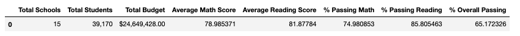
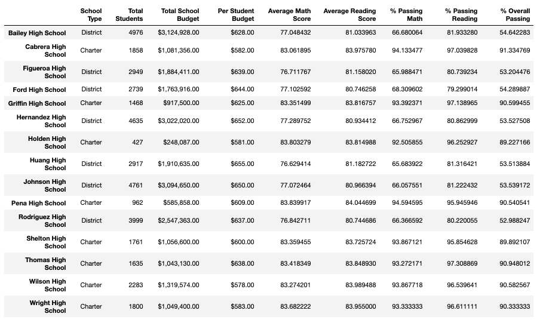
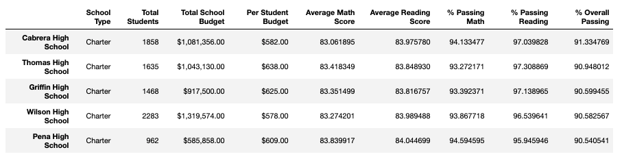
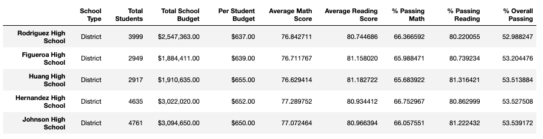
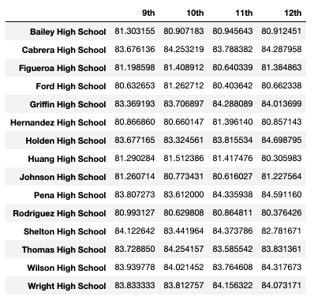
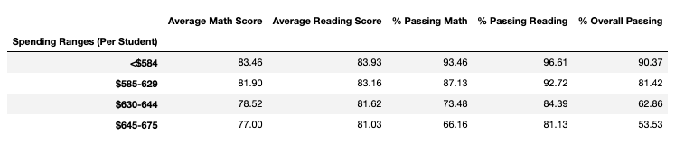
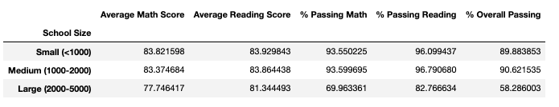
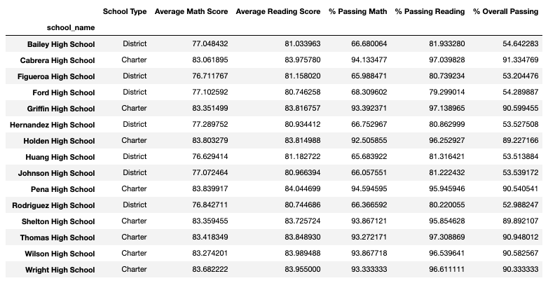
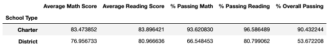

# Pandas-Challenge: PyCitySchools

I analyzed the district-wide standardized test results. I was given access to every student's math and reading scores, as well as various information on the schools they attend. My responsibility was to aggregate the data to and showcase obvious trends in school performance.

My final report included each of the following:

### District Summary

* Created a high level snapshot (in table form) of the district's key metrics, including:
  * Total Schools
  * Total Students
  * Total Budget
  * Average Math Score
  * Average Reading Score
  * % Passing Math (The percentage of students that passed math.)
  * % Passing Reading (The percentage of students that passed reading.)
  * % Overall Passing (The percentage of students that passed math **and** reading.)
  
  

### School Summary

* Created an overview table that summarized key metrics about each school, including:
  * School Name
  * School Type
  * Total Students
  * Total School Budget
  * Per Student Budget
  * Average Math Score
  * Average Reading Score
  * % Passing Math (The percentage of students that passed math.)
  * % Passing Reading (The percentage of students that passed reading.)
  * % Overall Passing (The percentage of students that passed math **and** reading.)
  
  

### Top Performing Schools (By % Overall Passing)

* Created a table that highlights the top 5 performing schools based on % Overall Passing. Include:
  * School Name
  * School Type
  * Total Students
  * Total School Budget
  * Per Student Budget
  * Average Math Score
  * Average Reading Score
  * % Passing Math (The percentage of students that passed math.)
  * % Passing Reading (The percentage of students that passed reading.)
  * % Overall Passing (The percentage of students that passed math **and** reading.)
  
  

### Bottom Performing Schools (By % Overall Passing)

* Created a table that highlighted the bottom 5 performing schools based on % Overall Passing. Included all of the same metrics as above.

  

### Math Scores by Grade\*\*

* Created a table that listed the average Math Score for students of each grade level (9th, 10th, 11th, 12th) at each school.

  

### Reading Scores by Grade

* Created a table that lised the average Reading Score for students of each grade level (9th, 10th, 11th, 12th) at each school.

  

### Scores by School Spending

* Created a table that broke down school performances based on average Spending Ranges (Per Student). Used 4 reasonable bins to group school spending. Included in the table each of the following:
  * Average Math Score
  * Average Reading Score
  * % Passing Math (The percentage of students that passed math.)
  * % Passing Reading (The percentage of students that passed reading.)
  * % Overall Passing (The percentage of students that passed math **and** reading.)
  
  

### Scores by School Size

* Repeated the above breakdown, but this time grouped schools based on a reasonable approximation of school size (Small, Medium, Large).

  

### Scores by School Type

* Repeated the above breakdown, but this time grouped schools based on school type (Charter vs. District).

  

  
